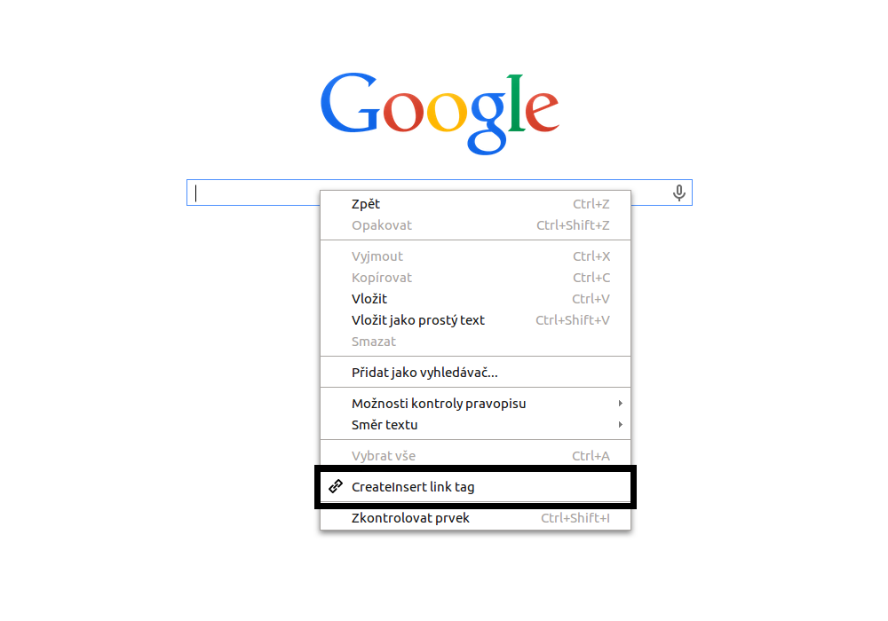
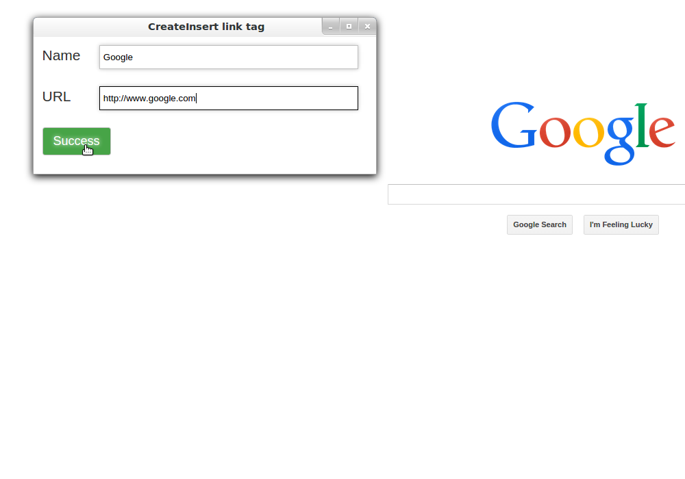

CreateInsert link tag
=======

Extension for Google Chrome. You can click to editable tag (textarea, input) and create + insert HTML link tag at this place. Name of link is automatically copied from clipboard.

Clone git:
--------------
    $ git clone https://github.com/tomasvalek/CreateInsertLink.git

Installation:
-------------
Drag file:CreateInsertLink.crx to Google Chrome window.

Google Chrome webstore
-------------
This extension is not in Google Chrome webstore.

Screenshots
-------------
Context menu:     

Create URL:     

Paste HTML tag:     

